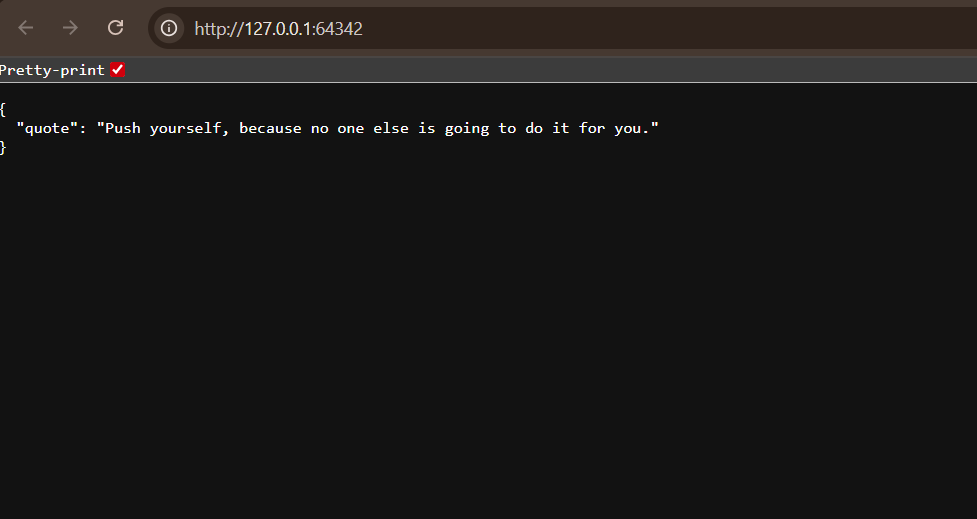

# 🔁 Random Quote API — Flask, Docker, Kubernetes

A minimalist REST API that returns a random motivational quote.  
Built for learning, deploying, and demonstrating DevOps in action.

---

# What is this?

This project is a simple Flask app wrapped in a Docker container and deployed via Kubernetes (Minikube). It serves one purpose: respond with a random quote in JSON format — fast, clean, and reliable.

---

##  Tech Stack

- **Python + Flask** – lightweight web framework
- **Docker** – containerize the app for portability
- **Kubernetes (Minikube)** – orchestrate and run in a local K8s cluster
- **GitHub** – version control + portfolio display
- **DockerHub** – public image repository

---

###  API Demo Screenshot

